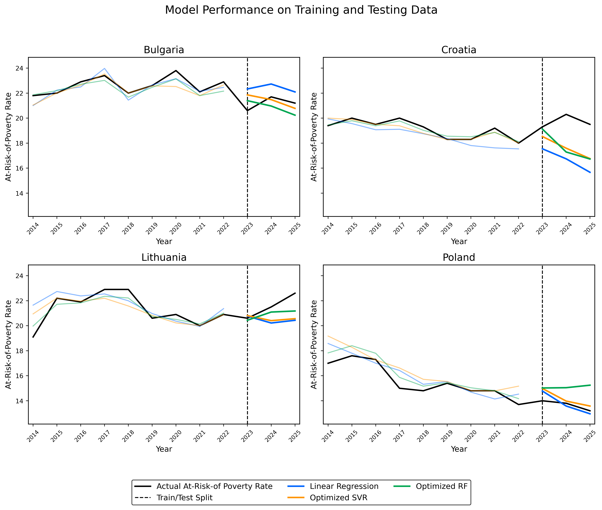
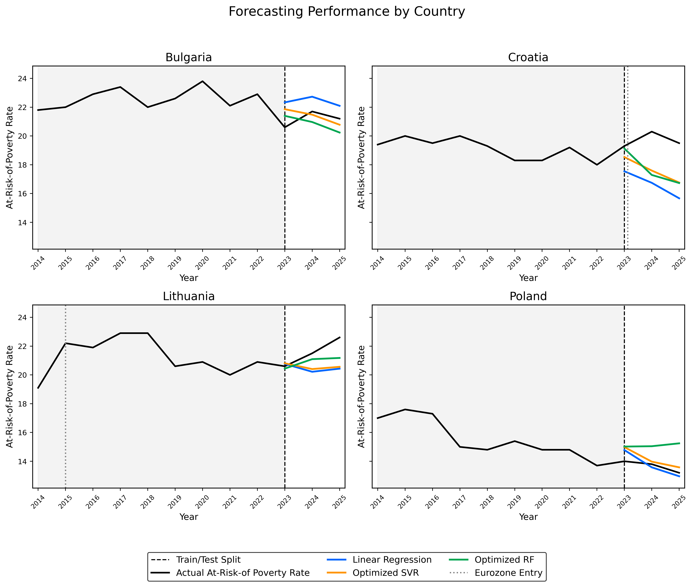
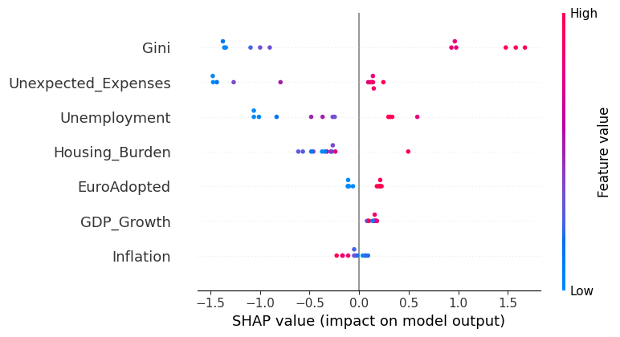
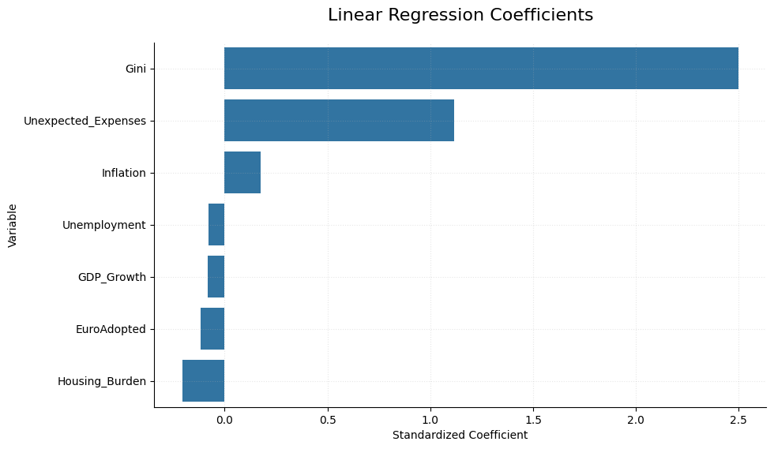
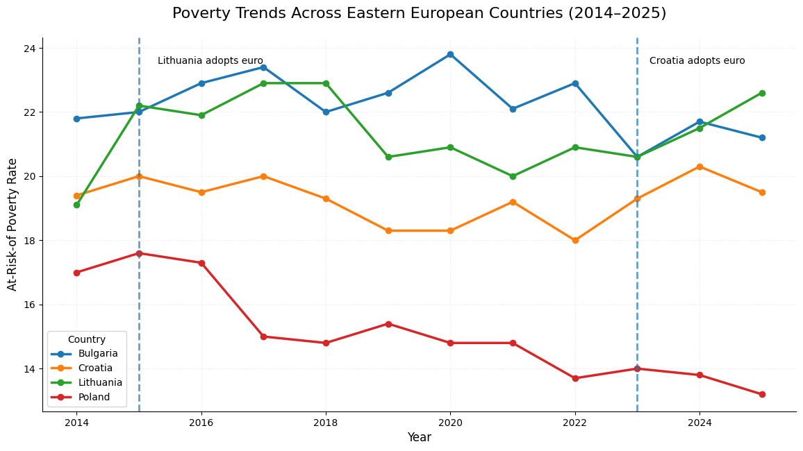
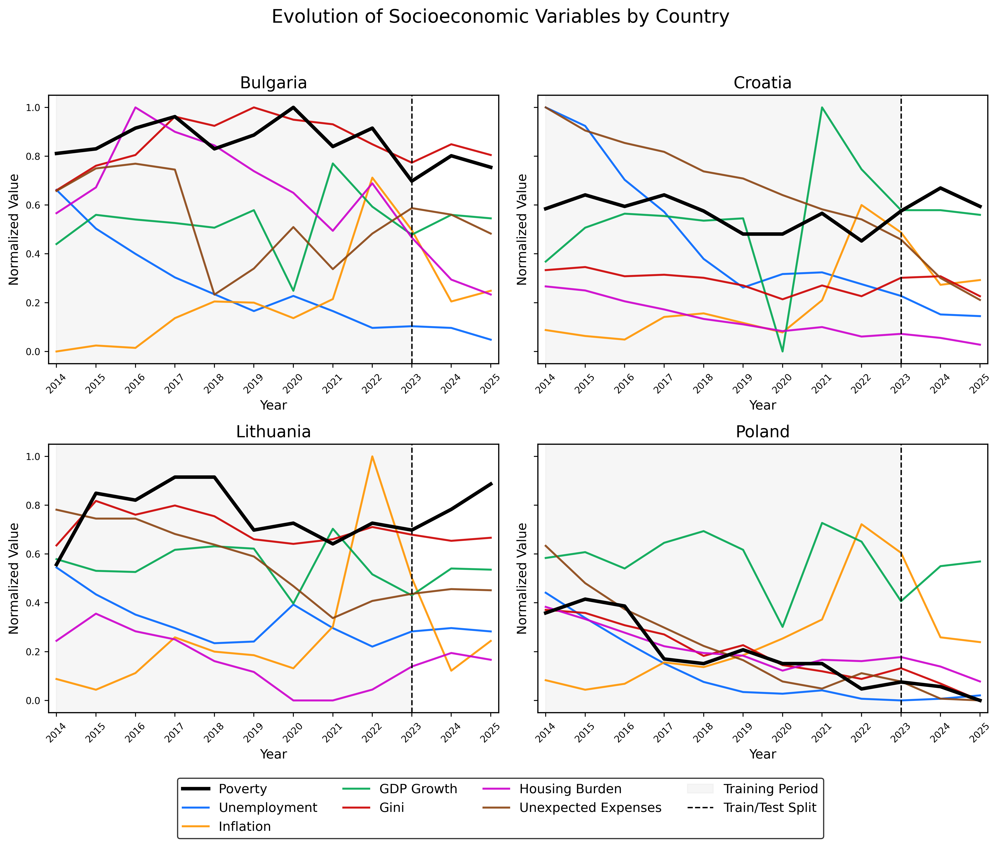
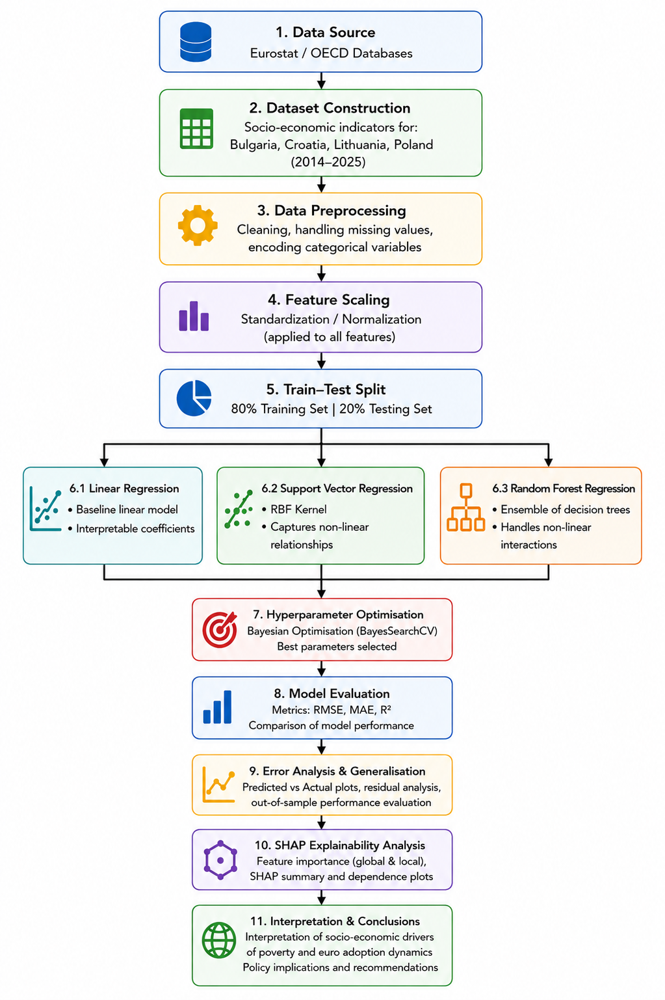

# Machine Learning Analysis of Poverty Dynamics and Euro Adoption in Eastern Europe

**Python • Machine Learning • SHAP • Random Forest • Support Vector Regression • scikit-learn**

## Overview

This repository contains the code accompanying my MSc Data Science & Society thesis completed at Tilburg University.

The research investigates whether machine learning models can accurately predict the **At-Risk-of-Poverty Rate (AROP)** using socioeconomic indicators in Eastern European countries, while exploring poverty dynamics within the context of Eurozone integration.

---

## Research Objectives

This project aims to:

- Predict poverty rates using machine learning techniques.
- Compare the performance of Linear Regression, Support Vector Regression (SVR), and Random Forest Regression.
- Identify the socioeconomic indicators most strongly associated with poverty.
- Improve model interpretability using Explainable Artificial Intelligence (SHAP).
- Explore poverty dynamics surrounding euro adoption.

---

## Dataset

The dataset was manually compiled from publicly available Eurostat and OECD data.

Countries included:

- Bulgaria
- Croatia
- Lithuania
- Poland

Time period:

**2014–2025**

Target variable:

- At-Risk-of-Poverty Rate (AROP)

Predictor variables:

- Unemployment
- Inflation
- GDP Growth
- Gini Coefficient
- Housing Burden
- Ability to Face Unexpected Expenses
- Euro Adoption Status

---

## Methodology

The workflow consists of:

- Data collection and integration
- Data preprocessing
- Exploratory Data Analysis (EDA)
- Feature scaling
- Time-based train/test split
- Bayesian hyperparameter optimisation
- Model evaluation
- SHAP explainability analysis

---

## Models

- Linear Regression
- Support Vector Regression (SVR)
- Random Forest Regression

Support Vector Regression and Random Forest were optimised using Bayesian hyperparameter optimisation.

---

## Evaluation

Model performance was evaluated using:

- Root Mean Squared Error (RMSE)
- Mean Absolute Error (MAE)
- R² Score

The models were evaluated using a chronological train-test split to preserve the temporal structure of the data.

---

## Results

### Model Performance

The optimised Support Vector Regression achieved the strongest predictive performance, followed by the optimised Random Forest model.

---

### Country-Level Forecasting

The figure below compares actual poverty rates with the predictions generated by the three machine learning models across all countries.

---

### SHAP Explainability

SHAP analysis identified the Gini coefficient, inability to face unexpected expenses, and unemployment as the most influential predictors of poverty outcomes.

---

### Linear Regression Interpretation

Standardised coefficients from the Linear Regression model provide an interpretable comparison of feature importance.

---

### Poverty Trends

Observed poverty trends across the four Eastern European countries.

---

### Socioeconomic Variable Evolution

Evolution of all socioeconomic variables throughout the study period.

---

### Research Pipeline

Overview of the complete machine learning workflow used throughout this project.

---

## Technologies

- Python
- pandas
- NumPy
- scikit-learn
- SHAP
- scikit-optimize
- matplotlib
- scipy
- statsmodels
- Jupyter Notebook

---

## Repository Contents

Currently this repository contains the complete notebook used for data preprocessing, model development, evaluation, and explainability analysis.

Future updates will include a cleaner project structure with separated notebooks, figures, and documentation.

---

## Thesis

**Machine Learning Analysis of Poverty Dynamics and Euro Adoption in Eastern Europe**

MSc Data Science & Society

Tilburg University

---

## Author

Yoana Petrova
